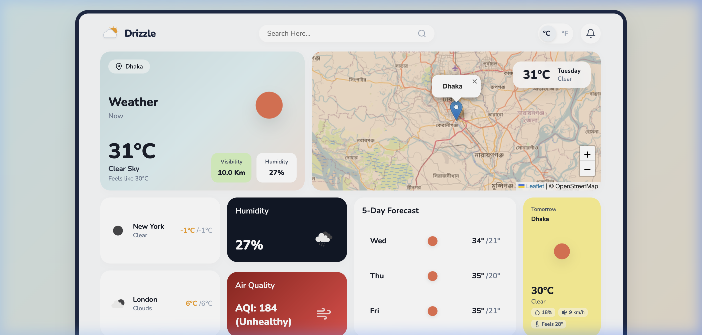

<div align="center">

# ☁️ Drizzle — Weather Dashboard

**A premium, real-time weather dashboard with interactive maps, forecasts, and air quality insights.**


</div>

---

<div align="center">

### 🖥️ Dashboard Preview



</div>

---

## ✨ Features

| Feature                     | Description                                                                                           |
| --------------------------- | ----------------------------------------------------------------------------------------------------- |
| 🗺️ **Interactive Map**      | Live Leaflet.js map with `flyTo()` animations and OpenWeatherMap temperature tile overlays            |
| 🌤️ **Dynamic SVG Graphics** | Context-aware artwork for forecasts — background color and CSS animations adapt to weather conditions |
| 🌬️ **Air Quality Index**    | Real-time AQI ratings from OpenWeather Air Pollution API alongside humidity data                      |
| 🔍 **Smart Autocomplete**   | Debounced city/country suggestions via OpenWeather Geocoding API                                      |
| 📅 **5-Day Forecast**       | Daily high/low temperatures with weather icons for the upcoming week                                  |
| 🕐 **Period-Based View**    | Forecast chunks mapped to Morning, Afternoon, Evening, and Night periods                              |
| 🌍 **Global City Feeds**    | Live parallel data streams for major cities (New York, London)                                        |
| 📍 **Geolocation**          | Instantly loads weather based on browser coordinates on launch                                        |
| 🎨 **Premium Aesthetics**   | Custom SVG icons, mesh gradients, glassmorphic dropdowns, dark-mode contrast cards                    |

---

## 🛠️ Tech Stack

<div align="center">

|                                                         Technology                                                         | Purpose                                |
| :------------------------------------------------------------------------------------------------------------------------: | -------------------------------------- |
|                           | Structure & Semantics                  |
|                              | Grid Layout, Animations, Glassmorphism |
|            | ES6+ Logic & API Integration           |
|                  | Interactive Mapping Engine             |
|  | Weather, Forecast, Geocoding, AQI      |
|        | Typography                             |

</div>

---

## 🚀 Getting Started

> **No complex Node.js setup required!** This is a vanilla frontend app.

```bash
# 1. Clone the repository
git clone https://github.com/YOUR_USERNAME/weather-app.git

# 2. Navigate to the project folder
cd weather-app

# 3. Run a local server
npx serve .

# 4. Open your browser to http://localhost:3000
```

---

## 🌐 Deployment

This app is vanilla frontend and ready to go live instantly!

<details>
<summary><b>▶️ Deploy to Vercel (Fastest)</b></summary>

```bash
npx vercel
```

</details>

<details>
<summary><b>▶️ Deploy to GitHub Pages</b></summary>

1. Push to a repository.
2. Go to repository **Settings → Pages**.
3. Select `main` branch as the source and save.

</details>

---

<div align="center">

⭐ _If this project helps you or if you use it in your portfolio, consider giving it a star!_ ⭐

</div>
